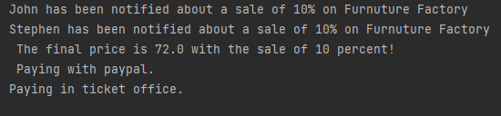

# Laboratory Work 3. Behavioral Patterns

### Course: Design Patterns
### Author: Nicolae Gherman

----

## Theory 

Behavioral design patterns are concerned with the interaction and responsibility of objects.
In these design patterns, the interaction between the objects should be in such a way that they can easily talk to each other and still should be loosely coupled.
That means the implementation and the client should be loosely coupled in order to avoid hard coding and dependencies.


## Objectives:

* Get familiar with behavioral design patterns
* Implement the  x out of 5 Behavioral Patterns.

## Implementation description 
I have implemented 3 Patters: 
* Visitor 
* Observer 
* Strategy 
<br>
I have decided to  simulate a simple Furniture Price calculation with additional tax and the moethod(actually strategy) of paying that piece of furniture. <br>

SO, The part with price calculation with the additional tax  is handled by a  <b> visitor </b> in  TaxAddVisitor folder. Every object that the Visitor visitors implements the double dispatcher feature, just an additional accept visitor method. (That refers to the Chair and Bed objects of the Furniture)  <br>
The  <b> Observer </b> Patterns applies to the logic of informing subscribers of a sale (a percentage number) on those items described above. So the actual Publisher is held in the 
FurnitureFactory folder and class and it is applied accordingly to manually choosing a sale.<br> 
The <b> Strategy  </b> Pattern is implemented through the choosing what payment method to apply. There are 2 options, through Office Ticket or Paypal  <br>

 
1.  Visitor 


Visitor is simple taking the object's price and adding a tax upon that.
```  
    @Override
    public void visit(Chair chairObj) {
        chairObj.setPrice(chairObj.getPrice() + chairObj.getPrice() * 0.6);
    }
}
```

2. Observer
Basically   abstract class describes the functionality of the Publisher:
```   
public abstract class Observable {
    private ArrayList<Observer>allObservers;

    public Observable() {
        allObservers = new ArrayList<Observer>();
    }

    public ArrayList<Observer> getAllObservers() {
        return allObservers;
    }

    public void attach(Observer obj){
        allObservers.add(obj);
    }

    public void deattach(Observer obj){
        allObservers.remove(obj);
    }

    abstract public void notifyAllObservers();
}
``` 

3. The actual payment method is choosed through company ticker ( actually encapsulated the logic in the class below ):
 
``` 
public class TicketCompany {
    private PaymentStrategy ourStrategy;

    public TicketCompany(PaymentStrategy ourStrategy) {
        this.ourStrategy = ourStrategy;
    }

    public void pay(){
        ourStrategy.pay();
    }
}
---  
##### The Main.java code 
``` 
  //two users
        Observer client1 = new Subscriber("John");
        Observer client2 = new Subscriber("Stephen");

        //creating a Subsriber on Factory to be informed about Sales!
        Observable saleInform = new Publisher();
        saleInform.attach(client1);
        saleInform.attach(client2);

        //Notifying users about a sale of 10 %
        saleInform.notifyAllObservers();
        // Includes Chair and Bed objects creationg and final price calculations
        FactoryPrices factory = new FactoryPrices();
        // Setting 10% sale
        factory.SetSale(10);
        // Visitor Objects will calculate the final price with tax included.
        System.out.printf(" The final price is %s with the sale of %s percent! %n ", factory.CalculateChairFinalPrice(50), factory.GetSale());


        // Initiliazing strategy Object and choosing the actual Payment Strategy
        TicketCompany company = new TicketCompany(new Paypal());
        company.pay();
        // Chaning the strategy Object and choosing another Payment Strategy
        company = new TicketCompany(new OfficeTicket());
        company.pay();
``` 


## The output: 
